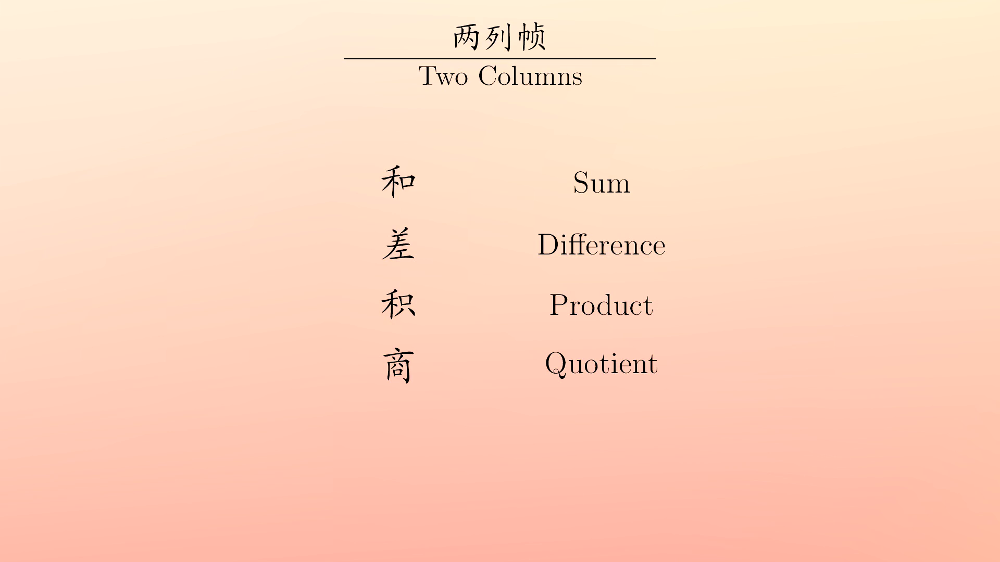
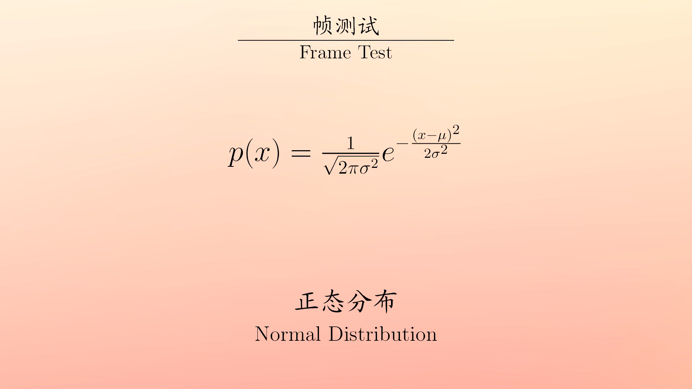

# Math Video Generator

- Goal: making (bilingual) math teaching videos with ease
- Still under construction

## Demo

## TODOs
- Trim text images
- Get frame durations from ASS subtitle files 

## Requirements
- LaTeX (xelatex and pdflatex)
- ImageMagick (for pdf to png conversion)
- OpenCV/ffmpeg (to generate videos)
- numpy
- Pillow

ffmpeg is able to generate small-sized videos with x264. However, I am not sure if it works on
Widndows, since the images are passed by PIPE.